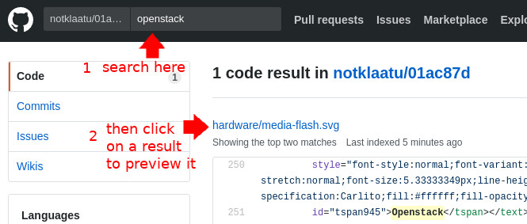

# Demo tagging repo search

This is a demonstration of how SVG files can be searched by "tag" within a Git repository.

Searches can be performed locally or from the web UI of github.com

The actual results may or may not make sense; this repo contains fairly random sample data that has been tagged for demonstration purposes only.

## Sample searches

Here are some searches to try:

* Linux filesystem structure
* network topology
* EAP 7 architecture
* OpenShift cluster architecture
* distributed volume

In addition to using

To perform a search through the web interface:

## Flexibility

Developers who don't want to use the web UI of Github can also search for "foo" from the command line:

    $ find path/to/repo/ -type f -name "*svg" -exec grep -li foo {} \;